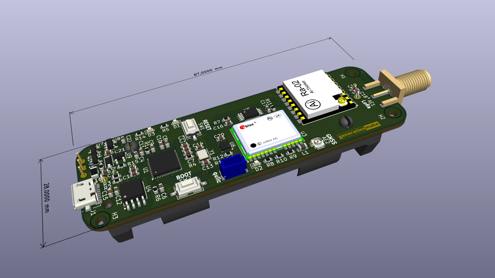

# RP2040LoRaTracker
Tracker with a Raspberry Pi RP2040, an AI-Thinker Ra-01 LoRa Module and an u-Blox GNSS receiver

## Firmware
* [ArduinoLoRaAPRSTracker](https://github.com/generationmake/ArduinoLoRaAPRSTracker): This is the default firmware for this board. It enables all basic functions as a ham radio LoRaAPRSTracker

## Antennas

### LoRa antenna (AE1)

SMA connector, 50 Ohm, for 433 MHz LoRa antenna.

### GNSS antenna (AE2)

U.FL connector, 50 Ohm, for GNSS antenna.

## Pinout

### USB (J1)

Micro-USB connector, connected to the RP2040 ant to charge the battery.

### I2C (J2)

compatible to the Sparkfun qwiic standard (https://www.sparkfun.com/qwiic). JST SH 1mm 4-pin.

| pin number | signal        |
|:----------:|:-------------:|
| 1          | GND           |
| 2          | +3V3          |
| 3          | I2C_SDA       |
| 4          | I2C_SCL       |

## Switches

### Reset (SW1)

push button to reset RP2040.

### Boot (SW2)

push button to set RP2040 to boot mode.

### on/off (SW3)

sliding switch to power board from battery.

## enclosure

There exists a 3D printable enclosure to encapsulate the PCB.

## PCB

### Top

### Bottom

